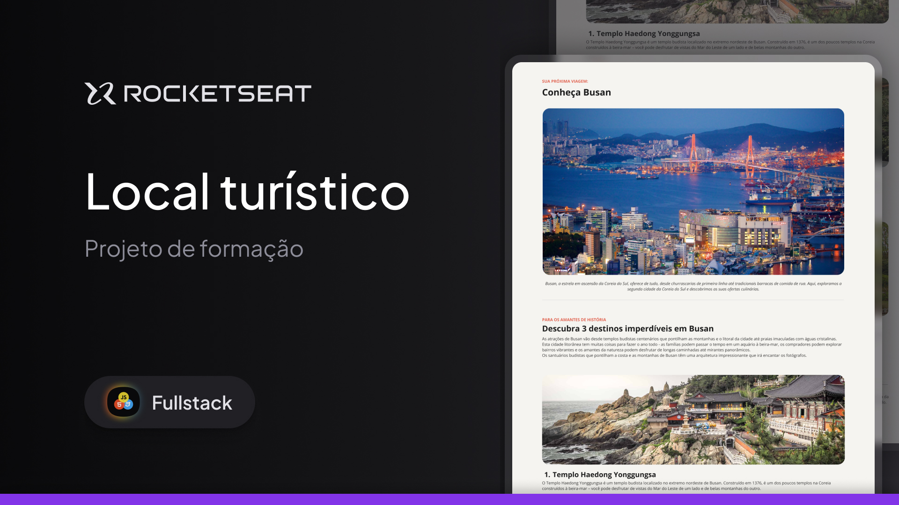

<h1 align="center"> Local Turístico ✈️ </h1>

Formação exclusiva pela Rocketseat para ensino de tecnologias WEB.

  <a href="#-tecnologias">Tecnologias</a>&nbsp;&nbsp;&nbsp;|&nbsp;&nbsp;&nbsp;
  <a href="#-projeto">Projeto</a>

  

 

## 🚀 Tecnologias

Esse projeto foi desenvolvido com as seguintes tecnologias:

- HTML e CSS
- Git e Github
- Figma

## 💻 Projeto

Este projeto é uma página web desktop com informações sobre um local turístico.

Esse é um dos desafios práticos da formação Fullstack, um de nossos conteúdos de especialização.

---

Feito com ♥ by Rocketseat

[Participe da nossa comunidade!](https://discord.gg/rocketseat)
